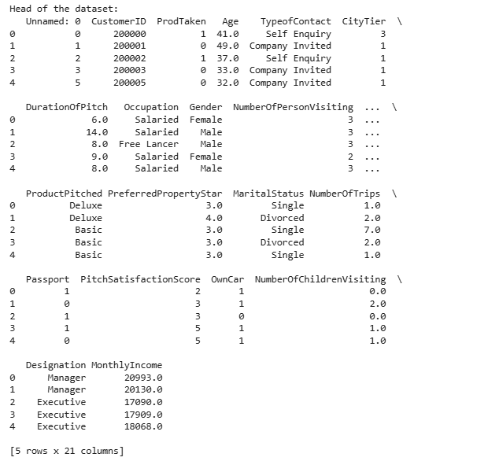
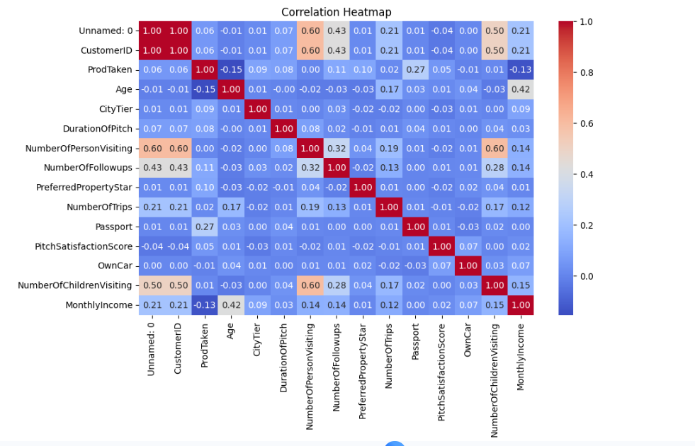
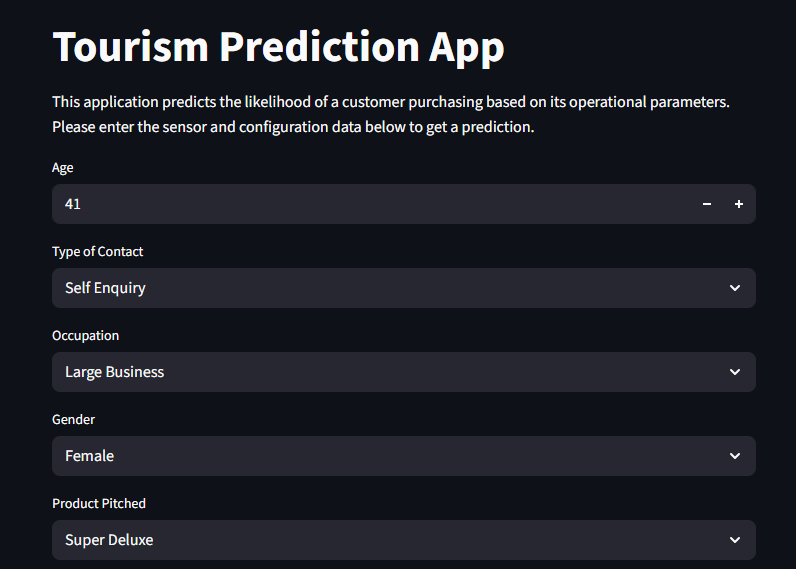

# 🌍 2. Tourism Demand Prediction

## 📌 Project Description
This project predicts tourism demand using historical data and machine learning models. It helps analyze trends and forecast future tourist visits for better decision-making.

---

## ✨ Features
- Data preprocessing and cleaning  
- Exploratory Data Analysis (EDA)  
- Machine learning model training  
- Demand forecasting  
- Visualization of trends

---

## 📸 Screenshots

### 📊 Dataset Preview


### 📈 Tourism Trend


### 🔥 Correlation Heatmap


### 🤖 Prediction Output


---

## 🛠️ Tech Stack
- Python  
- Pandas, NumPy  
- Matplotlib, Seaborn  
- Scikit-learn  

---

## 📊 Project Workflow
1. Data collection  
2. Data preprocessing  
3. Exploratory Data Analysis (EDA)  
4. Model training and evaluation  
5. Prediction and visualization  

---

## 📈 Results
The model predicts future tourism demand with good accuracy and visualizes trends using graphs and charts.

---

## ⚙️ Installation & Setup
```bash
git clone https://github.com/nayanasharma7124/Tourism-Demand-Prediction
cd Tourism-Demand-Prediction
pip install -r requirements.txt
jupyter notebook
